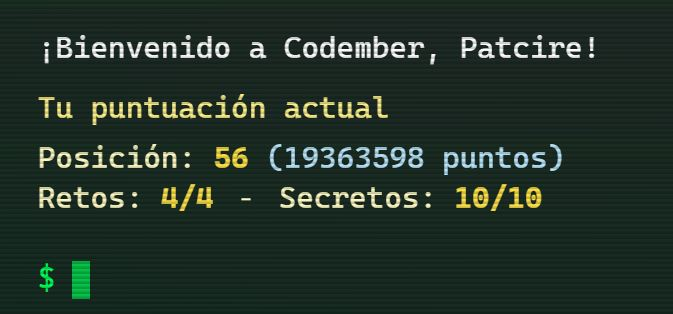

# Codember2023_Patcire

Mis soluciones a los distintos retos de programación de la iniciativa desarrollada por @midudev *Codember2023*.
Para los retos voy a usar JS, ya que es un lenguaje que estoy aprendiendo desde hace poco y quiero mejorar
con él.

¿Cómo quedé? (Actualizado a 29/11/2023)

